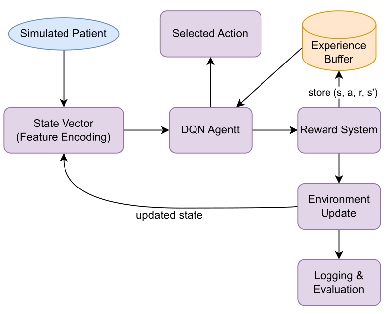

# 🧠 GaitLabAgent

**GaitLabAgent** is a simulation-based intelligent agent designed to replicate the core functions of a gait laboratory. Built with principles from **systems thinking**, **cybernetics**, and **reinforcement learning**, the agent provides personalized gait improvement recommendations based on biomechanical and contextual variables.

---

## 🚀 Project Motivation

Human gait is a complex and adaptive motor activity influenced by musculoskeletal, neurological, and environmental factors. Traditional gait labs offer precise analysis but are expensive and limited in accessibility. GaitLabAgent addresses this gap by simulating a digital agent that provides real-time, data-driven rehabilitation suggestions using AI techniques.

---

## 🧠 System Features

- **Deep Q-Learning (DQN)** agent trained on synthetic gait data
- **Simulated environment** based on multi-DOF biomechanical modeling
- **Causal loop diagrams** for understanding nonlinear interdependencies
- **Feedback mechanisms**:
  - Self-learning through reward-based interactions
  - Expert-supervised adjustments for human-in-the-loop refinement
- **Visualization tools**: confusion matrix, classification reports, reward plots

.png)

---

## 🏗 Architecture Overview

- **Sensors (simulated)**: Generate biomechanical features like speed, posture, and joint strength
- **Data**: Structured in CSV, simulating real-world gait assessments
- **Agent**: DQN policy selects among three discrete recommendations:
  - Maintain current routine
  - Improve posture
  - Rehabilitation exercises
- **Environment**: SimPy + Gymnasium simulate the patient's response and state transitions
- **Reward System**:
  - +1 for correct recommendation
  - -0.1 for incorrect recommendation
  - 

---

## 🛠 Technologies Used

- Python 3.10+
- Gymnasium
- Stable-Baselines3
- Scikit-learn
- Matplotlib / Seaborn

---

## 📚 References

- Martínez et al. (2010), *Desarrollo de un laboratorio de marcha*, Acta Biológica Colombiana  
- Martín Nogueras et al. (1998), *Fases de la marcha humana*, Revista Iberoamericana de Fisioterapia  
- Cheng et al. (2022), *Dynamic Modeling of Multibody Systems*, Machines  
- Cifuentes et al. (2010), *Análisis de la marcha*, Rev. Fac. Medicina  
- Hernández (2018), *Diving into Deep Q-Learning*, Towards Data Science  

